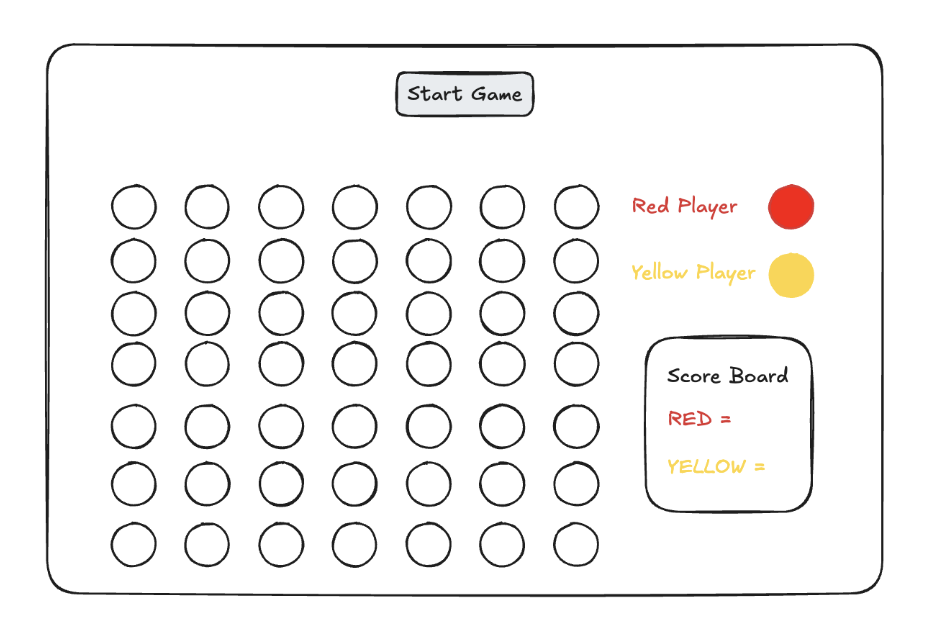
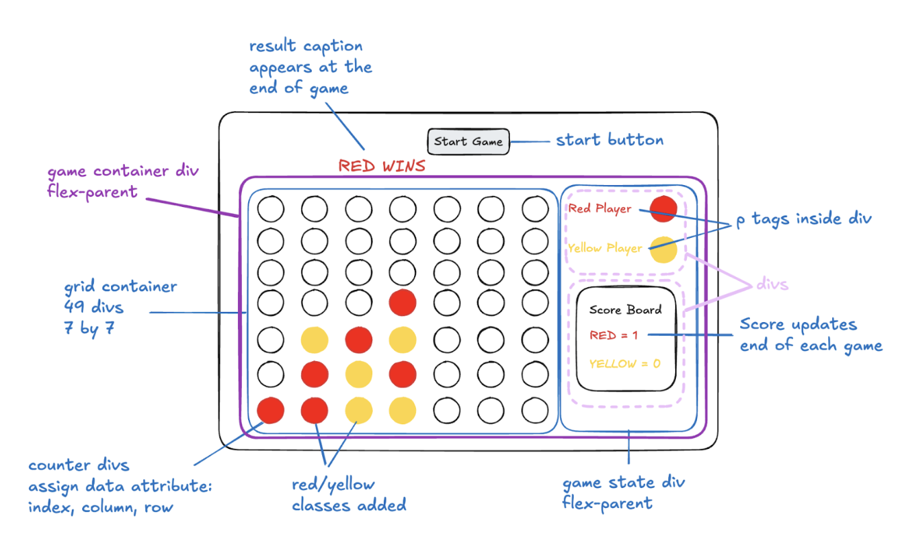

# Connect Four

## **Description**

For the third week of the course we were required to build an online game of our choosing using HTML, CSS and JavaScript. I chose to build the Connect 4 game, player vs player.

Connect 4 is a game where players take it in turns to drop a checker into a slot, on a 7 by 7 grid and the player can select which column to slide their checker into. The checker will slide to the bottom of the column, occupying the first available slot on the grid. The player’s checkers are differentiated by the colour, i.e. red vs yellow. The objective is to align four checkers in a row in any direction; horizontal, vertical, or diagonal. The first player to achieve this is declared the winner. If the board becomes full without a winner the game is declared a draw.
Connect 4 is a game where players take it in turns to drop a checker into a slot, on a 7 by 7 grid and the player can select which column to slide their checker into. The checker will slide to the bottom of the column, occupying the first available slot on the grid. The player’s checkers are differentiated by the colour, i.e. red vs yellow. The objective is to align four checkers in a row in any direction; horizontal, vertical, or diagonal. The first player to achieve this is declared the winner. If the board becomes full without a winner the game is declared a draw.

## **Deployment Link**

https://kam-gemini.github.io/connect-four-project/


## **Timeframe & Working Team (Solo/Pair/Group)**

We were given one week to complete this project, working independently.

## **Brief**

Build an online game using HTML, CSS and JavaScript.

* Render the game in the browser using the DOM manipulation techniques demonstrated in lecture.   
* Include win/loss logic and render win/loss messages in HTML. The game you choose must have a win/lose condition.   
* Include separate HTML, CSS, JavaScript, and JavaScript data files organized in an appropriate file structure.   
* The game is deployed online so the rest of the world can play it.

## **Technologies**

* HTML  
* CSS  
* JavaScript

## 

## **Planning**





## **Pseudocode**

Pseudocode was written after creating the wireframes and is included at the top of the JavaScript, including the following sections:

* HTML  
* Constants & Variables  
* Cached Elements  
* Functions   
* Event Listeners

## **Build/Code Process**

* Created layout in HTML using the above wireframe as a guide.  
* Used flex method to create the overall layout.  
* Generated the game board using JavaScript.

```
function generateBoard() {
  for (let idx = 0; idx < totalCheckers; idx++) {
    const cell = document.createElement('div');
    const circle = document.createElement('div');
    cell.classList.add('cell');
    circle.classList.add('circle');
    circle.dataset.index = idx;
    circle.dataset.row = Math.floor(idx / 7) + 1;
    circle.dataset.column = (idx % 7) + 1;
    cell.style.width = `${100 / gridColumns}%`;
    cell.style.height = `${100 / gridRows}%`;
    gridContainer.appendChild(cell).appendChild(circle);
    gridCells.push(cell);
    const circles = document.querySelectorAll(".circle");
  }
}
```

* Created a function that randomises the starting colour, for each game the colour of the first checker will be randomly selected.

```
function getStartingColor() {
  const startingCircle = document.createElement('div');
  playerTurn.appendChild(startingCircle);
  startingCircle.classList.add('player-turn');
  const randomIdx = Math.floor(Math.random() * colorChoice.length);
  startingColor = colorChoice[randomIdx];
  startingCircle.style.backgroundColor = startingColor;
  const startingColorIdx = colorChoice.indexOf(startingColor);
  if (startingColorIdx % 2 === 0) {
    evensColor = 'red';
    oddsColor = 'yellow';
  } else {
    evensColor = 'yellow';
    oddsColor = 'red';
  }
}
```

* Wrote code that determines which column is selected on click using data column attribute, then used the data row attribute to determine the position the checker will occupy. If ‘slot’ is occupied then iterate through the slots in that column until an empty slot is found.  
* Decided the UX would be enhanced if the game state section to the left of the board displayed whose turn it was rather than static Red player \- Yellow player labels from the original plans. Later added some styling to make it pulse.
* Wrote code that determines which column is selected on click using data column attribute, then used the data row attribute to determine the position the checker will occupy. If ‘slot’ is occupied then iterate through the slots in that column until an empty slot is found.  
* Decided the UX would be enhanced if the game state section to the left of the board displayed whose turn it was rather than static Red player \- Yellow player labels from the original plans. Later added some styling to make it pulse.

```
function selectPosition(event) {
  checkersNumber += 1;
  if (checkersNumber % 2 === 0) {
    turn = 'Evens';
  } else {
    turn = 'Odds';
  }
  column = event.target.dataset.column;
  columnArray = Array.from(boardCircles).filter(div => div.dataset.column === column);
  for (let idx = columnArray.length; idx >= 0; idx--) {
    row = idx;
    const targetCell = document.querySelector(`[data-row="${row}"][data-column="${column}"]`);
    const backgroundColor = window.getComputedStyle(targetCell).backgroundColor;
    if (backgroundColor === 'rgb(255, 255, 255)') {
      startingCircle = document.querySelector('.player-turn');
      if (turn === 'Evens') {
        targetCell.style.backgroundColor = evensColor;
        startingCircle.style.backgroundColor = oddsColor;
      } else {
        targetCell.style.backgroundColor = oddsColor;
        startingCircle.style.backgroundColor = evensColor;
      }
      break;
    }
  }
}
```

* Wrote code that checks for Four-in-a-row vertically, horizontally and diagonally. Abandoned the original approach of iterating through adjacent cells and went with an array method.  
* Essentially when a checker is played, the code obtains an array containing the row of cells and then iterates through to check if there are Four-in-a-row for the same color of that checker. The same is then done to check for a vertical winner by checking on the array of cells in that column.

```
function checkWinner() {
  if (checkersNumber % 2 === 0) {
    color = evensColor;
  } else {
    color = oddsColor;
  }
  targetCell = document.querySelector(`[data-row="${row}"][data-column="${column}"]`); // position of last checker played
  let checkWinningColor = targetCell.style.backgroundColor; // color of last checker played

  let colorColumnArray = [];
  columnArray.forEach(div => { // transform array to color attribute held by each cell
    const color = div.style.backgroundColor;
    colorColumnArray.push(color);
  });
  let connectedCheckers = 0;
  for (let i = 0; i < colorColumnArray.length; i++) {
    if (colorColumnArray[i] === checkWinningColor) {
      connectedCheckers++;
    } else {
      connectedCheckers = 0;
    }
    checkFourInARow(connectedCheckers, checkWinningColor);
  }
}
```

* By far the most difficult part of the code was figuring out how to check for diagonal winners and required a function of its own. This was done by creating a list of diagonal arrays using the index value of each cell and then following the same principle above and checking for matching colors. However, the fact that there were some overlapping diagonals made this much more challenging and meant in some cases you have to check for a winner in two directions.

```
function diagonalArrays(firstDiagonalArray, secondDiagonalArray, checkWinningColor) {
  let connectedCheckers = 0;
  const boardCircles = document.querySelectorAll(".circle");
  let diagonalArray = Array.from(boardCircles).filter((_, index) => firstDiagonalArray.includes(index)); // filter array based on target cell index and array of cells in that diagonal
  let colorArray = [];
  diagonalArray.forEach(div => {
    const color = div.style.backgroundColor; // transform diagonal array to color attributes for that array
    colorArray.push(color);
  });
  connectedCheckers = 0;
  for (let i = 0; i < colorArray.length; i++) { // check for matching colors in the array
    if (colorArray[i] === checkWinningColor) {
      connectedCheckers++;
    } else {
      connectedCheckers = 0;
    }
    checkFourInARow(connectedCheckers, checkWinningColor);
  }

  if (secondDiagonalArray && secondDiagonalArray.length > 0 && connectedCheckers < 4) { // filter on second diagonal array for when cell belongs to overlapping diagonals
    connectedCheckers = 0;
    diagonalArray = Array.from(boardCircles).filter((_, index) => secondDiagonalArray.includes(index));
    colorArray = [];
    diagonalArray.forEach(div => {
      const color = div.style.backgroundColor;
      colorArray.push(color);
    });
    connectedCheckers = 0;
    for (let i = 0; i < colorArray.length; i++) {
      if (colorArray[i] === checkWinningColor) {
        connectedCheckers++;
      } else {
        connectedCheckers = 0;
      }
      checkFourInARow(connectedCheckers, checkWinningColor);
    }
  }
}
```

* The function below checks and declares a winner and updates the scoreboard.

```
function checkFourInARow(connectedCheckers, checkWinningColor) {
  if (connectedCheckers === 4) {
    boardCircles.forEach(circle => circle.removeEventListener('click', selectPosition));
    gameResult.innerHTML = `${checkWinningColor} Wins`.toUpperCase(); // declare result in caption above board
    gameResult.style.color = checkWinningColor; // add winning color to result text
    if (checkWinningColor === 'red') { // update scoreboard
      redWins++;
      redScore.innerHTML = `${checkWinningColor.charAt(0).toUpperCase()}${checkWinningColor.slice(1).toLowerCase()} = ${redWins}`;
    } else {
      yellowWins++;
      yellowScore.innerHTML = `${checkWinningColor.charAt(0).toUpperCase()}${checkWinningColor.slice(1).toLowerCase()} = ${yellowWins}`;
    }
  }
}
```   

* Added an exception, in case of a draw, i.e. if all 49 checkers are played.  
* Improved the overall look and feel by adding some styling in CSS, including pulse feature for player turn.  
* Fixed bugs and cleaned up the code.  
* Tested the game by playing it with family members.

## **Challenges**

The most challenging aspect of this project was writing the code that determined any possible winner at each play, as a winner could be declared for Four-in-a-row in any direction. 

My initial approach of iterating through adjacent cells one by one, whilst it worked for vertical and horizontal winners, was clunky and inefficient, and completely impractical for diagonals. 

Once confronted by these issues for diagonals I decided to change my approach and use an array method, which was a much better strategy and resulted in cleaner and more robust code. This led me to re-visit code I had written for vertical and horizontal wins and re-write that code in-line with this new approach. Although the previous code had been tested and was working, I considered it important for consistency and efficiency.

Having completed a fully working and tested version, I decided to enhance the UX by highlighting the winning “hand” with a golden border. This proved more tricky than imagined as the original code was not designed with that in mind. However, I was able to implement this feature and integrate it within the original function and even managed to make the code more streamlined as I had to target elements in a more efficient way, which resulted in the same number of lines (of code), if not less.

## **Wins**

* Pseudocode was comprehensive and really helped map out the overall build approach.  
* Randomising the player-turn at the start of each game and then having the checker ‘pulse’ to indicate who’s turn it was.  
* Resolving the problem of figuring out how to check for diagonal wins by using the array method.  
* Implementing the array method for horizontal and vertical wins.  
* Enhancing the UX by adding a gold border to the winning “hand”, this was done after a working version of the game had already been completed.  
* Made every effort to ensure the code is “DRY” and not too “WET”.

## **Key Learnings/Takeaways**

This project really helped me grow in my coding journey and I will take away many valuable lessons from it. Firstly, the importance of planning, the more comprehensive and thorough it is, the easier and smoother the build process will be. Also, having the foresight to anticipate potential problems/difficulties in the planning stages should help inform the build approach. Spending a little extra time at the start can go a long way.

I now have a much better conception of the DOM and understanding of how to target and manipulate objects using JavaScript. I have definitely sharpened my HTML, CSS and JavaScript skills and demonstrated important problem solving skills.

## **Bugs**

I have tested the game as thoroughly as one can when it comes to testing their own work and am not aware of any bugs.

## **Future Improvements**

I could enhance the user experience by highlighting the winning “hand”, adding some styling to the four-in-a-row to make them stand out from the rest of the board.

I could also add a time element to the game, where each player has a limited time to play their turn and any breaches result in a penalty, e.g. three time penalties and the player forfeits the game, opposing player awarded the win.

